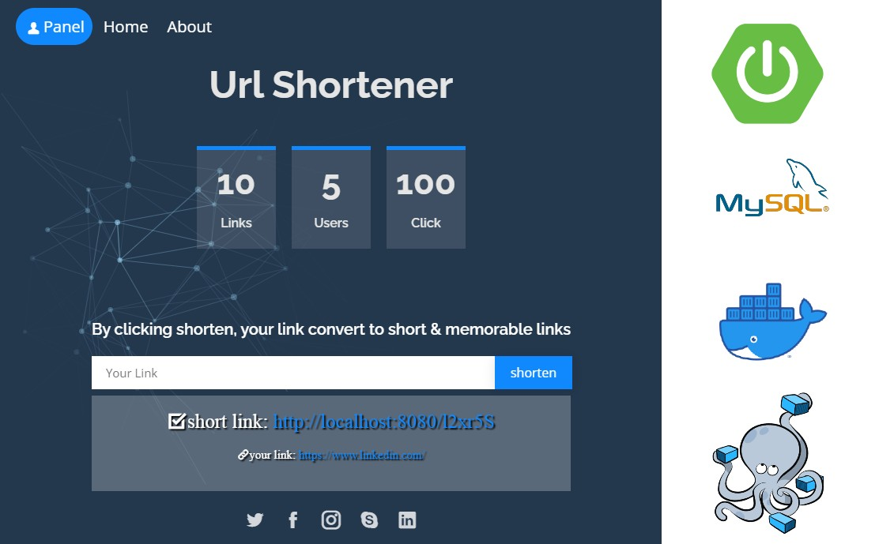

# url_shortener
With url shortener, your link convert to short &amp; memorable links

### Start the Application with the help of Docker
Go to the project directory and execute 
the following command in the terminal

    docker-compose up
    
And we are done, the **SpringBoot App** will be starting on port 
**8080** and **MySQL** is on **3306**

### Requirements To Run Application Without Docker
* JDK 1.8
* MySQL

### Dependencies And Tools Used To Build Application
* Git
* JDK 1.8
* Spring Boot
* data-jpa
* starter-web
* starter-security
* Maven
* thymeleaf
* bootstrap
