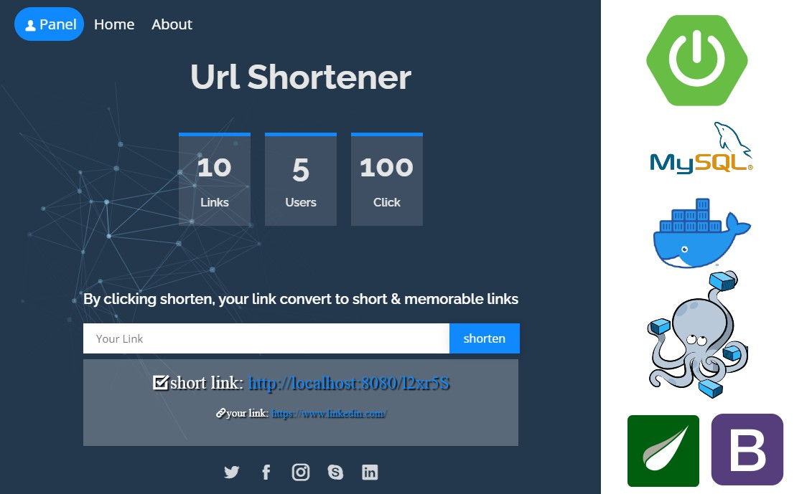

# url_shortener
With url shortener, your link convert to short &amp; memorable links

### Start the Application with the help of Docker
Go to the project directory and execute 
the following command in the terminal

    docker-compose up
    
And we are done, the **SpringBoot App** will be starting on port 
**8080** and **MySQL** is on **3306**

### Requirements To Run Application Without Docker
* JDK 1.8
* MySQL

### Dependencies And Tools Used To Build Application
* Git
* JDK 1.8
* Spring Boot
* data-jpa
* starter-web
* starter-security
* Maven
* thymeleaf
* bootstrap

### kubernetes (Minikube)
Create Docker image from Dockerfile and push on Dockerhub

    docker build -t <your-docker-hub-id>/url_shortener .
    docker push <your-docker-hub-id>/url_shortener
    
Crete pod

    kubectl create deployment urlshortener --image=<your-docker-hub-id>/url_shortener
    
If error while pulling image

1-Can use local Docker image on Minikube

    minikube image load <IMAGE_NAME>
    # Example
    minikube image load sheikhoo/url_shortener
    
2-Can use `docker pull` on Minikube

    minikube ssh docker pull <IMAGE_NAME>
    # Example
    minikube ssh docker pull sheikhoo/url_shortener
   
# To-Do:
- [ ] Admin panel
- [ ] Manage site setting
- [ ] Manage links
- [ ] Manage users
